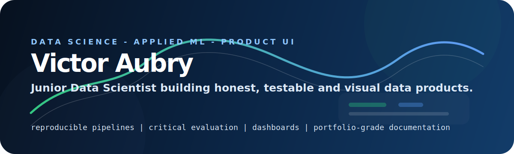

  

  
  
  
  

## Bonjour, moi c'est Victor

Je suis **Data Scientist junior**, passionné par l'IA appliquée, les interfaces produit, l'ingénierie, l'aviation, la course automobile et les systèmes techniques ambitieux.

Mon portfolio est construit autour d'une idée simple : ne pas seulement montrer des notebooks, mais transformer chaque projet en **système lisible, testable et compréhensible**. J'aime relier le modèle, les données, l'API, le dashboard et la documentation pour raconter une démarche complète.

Aujourd'hui, je cherche à rejoindre une équipe où je peux progresser comme **Data Scientist / AI Engineer junior**, avec un socle solide en Python, machine learning, data pipelines, évaluation critique et interfaces de restitution.

## Ce Que Je Construis

- **Machine Learning appliqué** : recommandation, NLP, segmentation, scoring, séries temporelles.
- **Computer Vision** : extraction de features, segmentation sémantique, pipelines distribués.
- **Analytics produit** : cadrage MVP, KPI, ROI, risques, RGPD, dashboards.
- **Interfaces data** : Streamlit, React, Vite, dashboards statiques et visualisations propres.
- **Engineering portfolio** : README solides, tests, CI, séparation des dépendances, données documentées.

## Stack Principale

  
  
  
  
  
  
  
  
  
  
  
  
  

## Projets Phares

| Projet | Sujet | Ce Que Le Projet Montre |
|---|---|---|
| [neural-exchange](https://github.com/VicoD3X/neural-exchange) | LSTM expérimental sur séries financières | Pipeline Rev4 reproductible, baselines causales, graphes, reporting, GitHub Pages |
| [insight-engine](https://github.com/VicoD3X/insight-engine) | Analytics MVP Fashion-Insta | Extraction Excel, KPI, ROI, risques, RGPD, dashboard React local et GitHub Pages |
| [spark-vision](https://github.com/VicoD3X/spark-vision) | Computer Vision distribuée | PySpark, MobileNetV2, AWS EMR, S3, extraction modulaire du pipeline |
| [urban-segmenter](https://github.com/VicoD3X/urban-segmenter) | Segmentation sémantique Cityscapes | U-Net, FastAPI, Streamlit, métriques CV, démonstrateur local |
| [nlp-sentinel](https://github.com/VicoD3X/nlp-sentinel) | NLP et feedback loop | TF-IDF baseline, FastAPI, Streamlit, monitoring local/Azure, boucle utilisateur |
| [sql-segmenter](https://github.com/VicoD3X/sql-segmenter) | Segmentation client Olist | SQL, RFM, clustering, maintenance, ARI, pipeline Python testable |
| [reco-engine](https://github.com/VicoD3X/reco-engine) | Recommandation d'articles | Content-based filtering, Azure Functions, Streamlit, cold-start |
| [quality-analysis](https://github.com/VicoD3X/quality-analysis) | Audit qualité OpenFoodFacts | Profiling, score qualité explicable, rapport JSON/MD/HTML, Streamlit |
| [bank-metrics](https://github.com/VicoD3X/bank-metrics) | Portail bancaire React + analytics | Redux, mode démo, transactions mockées, métriques financières, GitHub Pages |
| [rental-catalog](https://github.com/VicoD3X/rental-catalog) | Catalogue immobilier React | React Router, données JSON locales, UI responsive, GitHub Pages |

## Mon Fil Rouge

Je préfère un projet qui dit clairement **ce qu'il fait, ce qu'il ne fait pas et comment le vérifier** plutôt qu'un projet qui survend ses résultats.

Mes standards actuels :

- documentation lisible en moins d'une minute ;
- données et artefacts explicitement documentés ;
- tests légers mais utiles ;
- CI quand c'est pertinent ;
- évaluation critique des modèles ;
- séparation entre exploration, pipeline et interface ;
- dashboards sobres, utiles et démontrables.

## Focus Actuel

- Renforcer mon portfolio pour viser un poste de **Data Scientist / AI Engineer junior**.
- Continuer à travailler sur des projets hybrides : data, ML, interfaces et storytelling technique.
- Garder une approche pragmatique : produire des projets propres, honnêtes, lançables et auditables.

## Quelques Statistiques GitHub

  
  

## Me Trouver

- GitHub : [VicoD3X](https://github.com/VicoD3X)
- Portfolio GitHub Pages : en construction progressive via les projets épinglés

> Ce profil est pensé comme une porte d'entrée : chaque dépôt important doit pouvoir être compris, lancé ou audité sans deviner le contexte.
