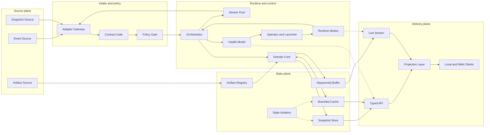

  

<h1 align="center">Software Engineer | Backend Architecture · AI Infrastructure</h1>

  I build backend platforms for data-intensive and AI-enabled products.

  
  
  
  
  
  
  

  <a href="#02--reference-architecture">Architecture</a> ·
  <a href="#03--selected-work">Projects</a> ·
  <a href="#04--stack">Stack</a> ·
  <a href="#05--activity">Activity</a> ·
  <a href="https://www.linkedin.com/in/victor-aubry-558491325/">LinkedIn</a>

---

## 01 — Profile

I build the layer between data or models and the people who use them: APIs, background workers, state stores, live feeds, local runtimes, and operational controls.

My background is in data science. Today my work is centered on software architecture—how services communicate, recover, stay observable, and remain simple to operate.

**Current focus:** backend platforms, AI runtimes, event-driven flows, local-first software, and distributed processing.

## 02 — Reference architecture

A recurring topology in the systems I build: contract-driven, local-first, and able to serve snapshots and live updates from the same runtime.

```mermaid
flowchart LR
    subgraph sources["Source plane"]
        direction TB
        eventSource["Event Source"]
        snapshotSource["Snapshot Source"]
        artifactSource["Artifact Source"]
    end

    subgraph intake["Intake and policy"]
        direction TB
        adapters["Adapter Gateway"]
        contracts["Contract Gate"]
        policy["Policy Gate"]
    end

    subgraph core["Runtime and control"]
        direction TB
        launcher["Operator and Launcher"]
        modes["Runtime Modes"]
        orchestrator["Orchestrator"]
        domain["Domain Core"]
        workers["Worker Pool"]
        health["Health Model"]
    end

    subgraph state["State plane"]
        direction TB
        eventBuffer["Sequenced Buffer"]
        snapshotStore["Snapshot Store"]
        cache["Bounded Cache"]
        registry["Artifact Registry"]
        isolation["State Isolation"]
    end

    subgraph delivery["Delivery plane"]
        direction TB
        api["Typed API"]
        live["Live Stream"]
        projection["Projection Layer"]
        clients["Local and Web Clients"]
    end

    eventSource --> adapters
    snapshotSource --> adapters
    artifactSource --> registry
    adapters --> contracts --> policy --> orchestrator
    orchestrator --> domain
    orchestrator --> workers
    workers --> adapters
    registry --> domain
    domain --> eventBuffer
    domain --> snapshotStore
    domain <--> cache
    eventBuffer --> live
    snapshotStore --> api
    cache --> api
    api --> projection
    live --> projection
    projection --> clients
    launcher --> modes --> orchestrator
    orchestrator --> health --> launcher
    isolation -.-> snapshotStore
    isolation -.-> cache
    health -.-> api
    modes -.-> live
```

<strong>Design notes</strong>

- **Two delivery paths:** ordered events for low-latency updates; snapshots for startup, recovery, and degraded operation.
- **Contracts at the edge:** adapters absorb provider differences before data reaches the domain core.
- **Bounded runtime state:** caches, histories, queues, workers, and retention limits remain explicit.
- **Separate control plane:** health, maintenance, read-only operation, and lifecycle control do not depend on the client path.
- **Isolated runtimes:** live and test state, secrets, caches, and local storage use separate namespaces.
- **Deterministic artifacts:** assets are verified before promotion and consumed through stable interfaces.

## 03 — Selected work

| Project | System |
| --- | --- |
| [NLP Sentinel](https://github.com/VicoD3X/nlp-sentinel) | Typed FastAPI inference API with cached model loading, local/Azure telemetry, and feedback capture. |
| [Spark Vision](https://github.com/VicoD3X/spark-vision) | Distributed image-feature extraction with PySpark UDFs, MobileNetV2, EMR/S3, and Parquet. |
| [Reco Engine](https://github.com/VicoD3X/reco-engine) | Azure Functions recommendation API with Blob-backed artifacts, cold-start fallback, and a Streamlit client. |
| [Urban Segmenter](https://github.com/VicoD3X/urban-segmenter) | Keras segmentation pipeline served through FastAPI, with local or API execution from Streamlit. |

<strong>More engineering work</strong>

- [Auto-CV](https://github.com/VicoD3X/auto-cv) — local-first Python desktop workflow with SQLite repositories, deterministic document processing, adapter boundaries, and local `llama.cpp` lifecycle management.
- [Neural Exchange](https://github.com/VicoD3X/neural-exchange) — reproducible PyTorch time-series pipeline with causal baselines, persisted artifacts, automated reports, and offline tests.
- [Freight Network](https://github.com/VicoD3X/freight-network) — modular graph-analysis package with deterministic synthetic data, automated outputs, tests, and CI.

## 04 — Stack

| Layer | Tools |
| --- | --- |
| Backend | Python · TypeScript · FastAPI · Pydantic · REST · SSE · SQLite |
| AI runtime | PyTorch · TensorFlow · scikit-learn · local `llama.cpp` inference |
| Data systems | SQL · pandas · PySpark · Parquet · NetworkX |
| Applications | PySide6 · React · Vite · Streamlit |
| Cloud and operations | AWS EMR · Amazon S3 · Azure Functions · Application Insights · GitHub Actions |

## 05 — Activity

  

  

## 06 — Contact

The simplest way to reach me is [LinkedIn](https://www.linkedin.com/in/victor-aubry-558491325/).
