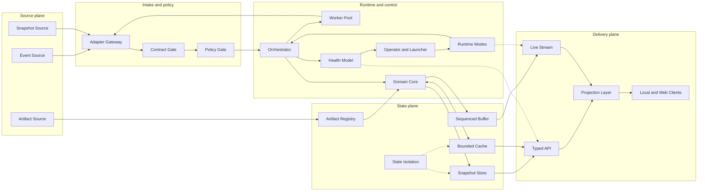

  

<h1 align="center">Software Engineer | Backend Architecture · AI Infrastructure</h1>

  Backend systems for data and AI workloads.

  
  
  
  
  
  
  

  <a href="#02--reference-architecture">Architecture</a> ·
  <a href="#03--selected-work">Projects</a> ·
  <a href="#04--stack">Stack</a> ·
  <a href="#05--activity">Activity</a> ·
  <a href="https://www.linkedin.com/in/victor-aubry-558491325/">LinkedIn</a>

---

## 01 — Profile

I work mainly in Python and TypeScript. I design APIs, background workers, stateful runtimes, live data paths, and operational tooling.

I started in data science and moved toward backend and platform work. I still use that background for model evaluation, data quality, and reproducible pipelines.

I spend most of my time on service boundaries, local-first runtimes, event delivery, model serving, health checks, and recovery.

## 02 — Reference architecture

The runtime below serves snapshots and ordered events from the same core. External sources pass through adapters and contracts; state and lifecycle controls stay outside the delivery path.

```mermaid
flowchart LR
    subgraph sources["Source plane"]
        direction TB
        eventSource["Event Source"]
        snapshotSource["Snapshot Source"]
        artifactSource["Artifact Source"]
    end

    subgraph intake["Intake and policy"]
        direction TB
        adapters["Adapter Gateway"]
        contracts["Contract Gate"]
        policy["Policy Gate"]
    end

    subgraph core["Runtime and control"]
        direction TB
        launcher["Operator and Launcher"]
        modes["Runtime Modes"]
        orchestrator["Orchestrator"]
        domain["Domain Core"]
        workers["Worker Pool"]
        health["Health Model"]
    end

    subgraph state["State plane"]
        direction TB
        eventBuffer["Sequenced Buffer"]
        snapshotStore["Snapshot Store"]
        cache["Bounded Cache"]
        registry["Artifact Registry"]
        isolation["State Isolation"]
    end

    subgraph delivery["Delivery plane"]
        direction TB
        api["Typed API"]
        live["Live Stream"]
        projection["Projection Layer"]
        clients["Local and Web Clients"]
    end

    eventSource --> adapters
    snapshotSource --> adapters
    artifactSource --> registry
    adapters --> contracts --> policy --> orchestrator
    orchestrator --> domain
    orchestrator --> workers
    workers --> adapters
    registry --> domain
    domain --> eventBuffer
    domain --> snapshotStore
    domain <--> cache
    eventBuffer --> live
    snapshotStore --> api
    cache --> api
    api --> projection
    live --> projection
    projection --> clients
    launcher --> modes --> orchestrator
    orchestrator --> health --> launcher
    isolation -.-> snapshotStore
    isolation -.-> cache
    health -.-> api
    modes -.-> live
```

<strong>Design notes</strong>

- Ordered events carry live changes. Snapshots handle startup, recovery, and degraded operation.
- External adapters normalize source-specific payloads before domain code sees them.
- Every queue, cache, history, worker pool, and retention window has a fixed limit.
- Health, maintenance, read-only mode, and shutdown stay available when live workers are paused.
- Live and test runtimes keep separate state, caches, and secret namespaces.
- New artifacts are verified before they replace the active version.

## 03 — Selected work

| Project | System |
| --- | --- |
| [NLP Sentinel](https://github.com/VicoD3X/nlp-sentinel) | FastAPI inference API: typed schemas, cached model loading, local or Azure telemetry, and a feedback endpoint. |
| [Spark Vision](https://github.com/VicoD3X/spark-vision) | PySpark image-feature pipeline using pandas UDFs and MobileNetV2, with Parquet output on EMR/S3. |
| [Reco Engine](https://github.com/VicoD3X/reco-engine) | Azure Functions recommendation API with Blob-backed artifacts, an in-process cache, and a cold-start fallback. |
| [Urban Segmenter](https://github.com/VicoD3X/urban-segmenter) | Keras segmentation pipeline served by FastAPI, with a Streamlit client that runs locally or against the API. |

<strong>More engineering work</strong>

- [Auto-CV](https://github.com/VicoD3X/auto-cv) — local Python desktop application built around SQLite repositories, deterministic document generation, and a managed `llama.cpp` process.
- [Neural Exchange](https://github.com/VicoD3X/neural-exchange) — PyTorch time-series experiment with causal baselines, saved model artifacts, generated reports, and offline tests.
- [Freight Network](https://github.com/VicoD3X/freight-network) — Python graph-analysis package using deterministic synthetic data, NetworkX metrics, generated reports, tests, and CI.

## 04 — Stack

| Layer | Tools |
| --- | --- |
| Backend | Python · TypeScript · FastAPI · Pydantic · REST · SSE · SQLite |
| AI runtime | PyTorch · TensorFlow · scikit-learn · local `llama.cpp` inference |
| Data systems | SQL · pandas · PySpark · Parquet · NetworkX |
| Applications | PySide6 · React · Vite · Streamlit |
| Cloud and operations | AWS EMR · Amazon S3 · Azure Functions · Application Insights · GitHub Actions |

## 05 — Activity

  

  

## 06 — Contact

[LinkedIn](https://www.linkedin.com/in/victor-aubry-558491325/) is the best way to reach me.
