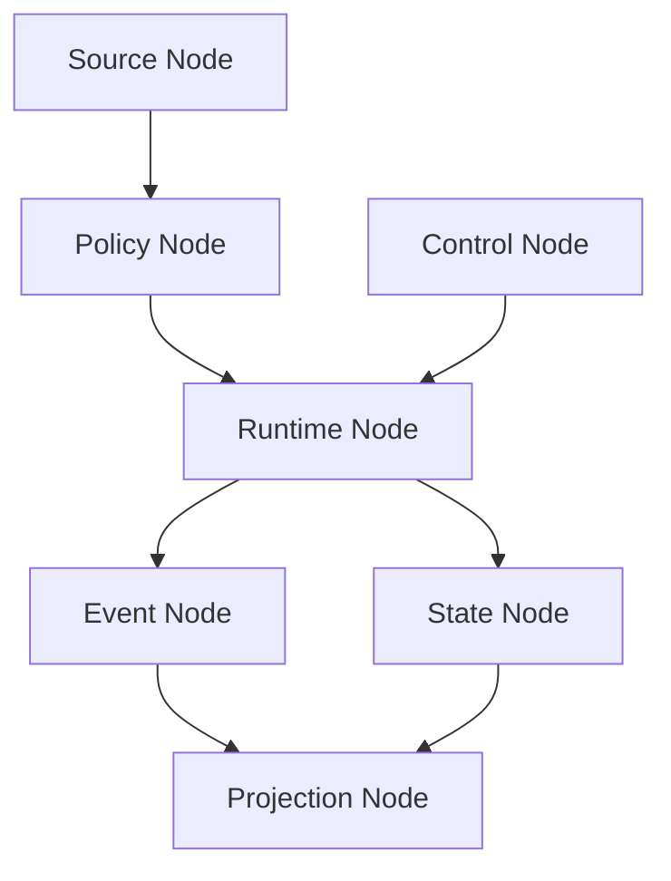

<!--
Future banner slot — intentionally left empty.
When the final asset is available, place a wide, lightweight image above the hero.
Recommended reference: assets/profile-banner.webp, approximately 4:1, width="100%".
-->

VICTOR AUBRY

<h1 align="center">Software Engineer | Backend Architecture · AI Infrastructure</h1>

I design backend systems that turn data, models, and live system state into structured application capabilities.

<a href="https://www.linkedin.com/in/victor-aubry-558491325/">LinkedIn</a> ·
<a href="#architecture-patterns">Architecture</a> ·
<a href="#selected-public-systems">Selected systems</a>

---

## Engineering profile

My work sits at the intersection of backend engineering and applied AI: service boundaries, contract-driven interfaces, local-first runtimes, asynchronous processing, inference APIs, operational feedback, and distributed data pipelines.

Data science is the foundation of that work, not the headline. It informs how I approach data contracts, model evaluation, reproducibility, and failure modes before a capability is exposed through an API or an application.

## Architecture patterns

Selected non-public systems are represented below only as generalized, domain-neutral patterns. Product names, providers, endpoints, schemas, data models, and operational parameters are intentionally excluded.

```mermaid
flowchart TD
    source["Source Node"] --> policy["Policy Node"]
    policy --> runtime["Runtime Node"]
    runtime --> event["Event Node"]
    runtime --> state["State Node"]
    event --> projection["Projection Node"]
    state --> projection
    control["Control Node"] --> runtime
```

- **Authoritative inputs** — source observations remain immutable; transformation and presentation are separate concerns.
- **Streaming with recovery** — sequenced event delivery, bounded replay, and snapshot fallback protect continuity.
- **Bounded state** — histories, caches, queues, concurrency, and retention have explicit ceilings.
- **Operational control** — liveness, readiness, deep health, maintenance circuit breakers, and read-only modes are designed into the runtime.
- **Isolation by contract** — shared schemas, one-directional dependencies, separate runtime namespaces, and local secret boundaries reduce coupling.

## Selected public systems

| System | Engineering evidence |
| --- | --- |
| [NLP Sentinel](https://github.com/VicoD3X/nlp-sentinel) | FastAPI inference service with typed schemas, cached model loading, configurable local/Azure telemetry, feedback capture, tests, and CI. |
| [Spark Vision](https://github.com/VicoD3X/spark-vision) | Distributed image-feature pipeline using PySpark, pandas UDFs, MobileNetV2, AWS EMR/S3, and Parquet outputs. |
| [Reco Engine](https://github.com/VicoD3X/reco-engine) | Serverless recommendation prototype using Azure Functions, Blob-backed inference assets, in-process caching, cold-start fallback, and a Streamlit client. |
| [Urban Segmenter](https://github.com/VicoD3X/urban-segmenter) | Semantic-segmentation inference lab with Keras, a FastAPI prediction endpoint, and a Streamlit client supporting local or API execution. |

<strong>Additional engineering work</strong>

- [Auto-CV](https://github.com/VicoD3X/auto-cv) — local-first Python desktop workflow with SQLite repositories, deterministic document processing, adapter boundaries, and local `llama.cpp` lifecycle management.
- [Neural Exchange](https://github.com/VicoD3X/neural-exchange) — reproducible PyTorch time-series pipeline with causal baselines, persisted artifacts, automated reports, and offline CI tests.
- [Freight Network](https://github.com/VicoD3X/freight-network) — modular graph-analysis and reporting package with deterministic synthetic data, automated outputs, tests, and CI.

## Core technologies

| Area | Evidence across public repositories |
| --- | --- |
| Backend | Python · FastAPI · Pydantic · REST APIs · Azure Functions |
| AI runtime | scikit-learn · PyTorch · TensorFlow · `llama.cpp`-compatible local inference |
| Data systems | SQL · SQLite · pandas · PySpark · Parquet · NetworkX |
| Application surfaces | PySide6 · Streamlit · React · Vite |
| Delivery and operations | GitHub Actions · AWS EMR · Amazon S3 · Azure Application Insights |

## Engineering principles

- Keep domain logic independent from transports, frameworks, and external providers.
- Make state ownership, failure modes, and recovery paths explicit.
- Prefer deterministic artifacts and observable behavior over hidden runtime assumptions.
- Start with the simplest viable execution model; distribute only where the workload requires it.
- Treat tests, documentation, and operational controls as part of the system design.

## Current focus

Backend platforms for AI-enabled products: model-serving boundaries, local and serverless inference, resilient data flows, operational telemetry, reproducible pipelines, and distributed batch processing.

The objective is practical: make data and model capabilities easier to run, inspect, test, and evolve as software.

## Contact

[LinkedIn](https://www.linkedin.com/in/victor-aubry-558491325/) · [GitHub](https://github.com/VicoD3X)
